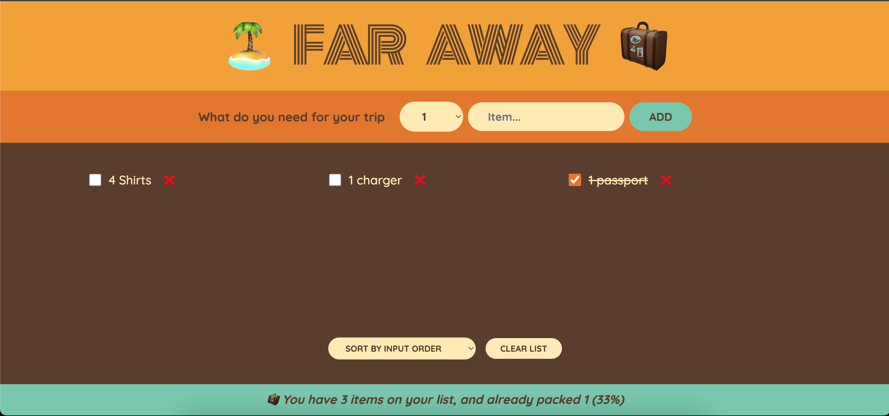

# React Packing List Application

This is a React application that helps users manage a packing list for their trips. The project was bootstrapped with [Create React App](https://github.com/facebook/create-react-app).

## Project Structure

- `src/App.jsx`: This is the main component of the application. It manages the state of the items in the packing list and handles the functions for adding, deleting, and toggling items.
- `src/components/Form.jsx`: This component is responsible for the form that adds new items to the packing list.
- `src/components/PackingList.jsx`: This component displays the list of items.
- `src/components/Stats.jsx`: This component displays statistics about the packing list.
- `src/components/Logo.jsx`: This component displays the logo of the application.
- `src/data/data.js`: This file contains some initial data for the application.

## Available Scripts

In the project directory, you can run:

- `npm start`: Runs the app in the development mode. Open [http://localhost:3000](http://localhost:3000) to view it in your browser.
- `npm test`: Launches the test runner in the interactive watch mode.

## Deployment

The application is ready to be deployed. It includes a `manifest.json` for PWA capabilities and all the necessary icons.
